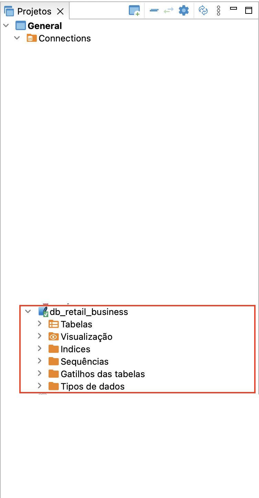
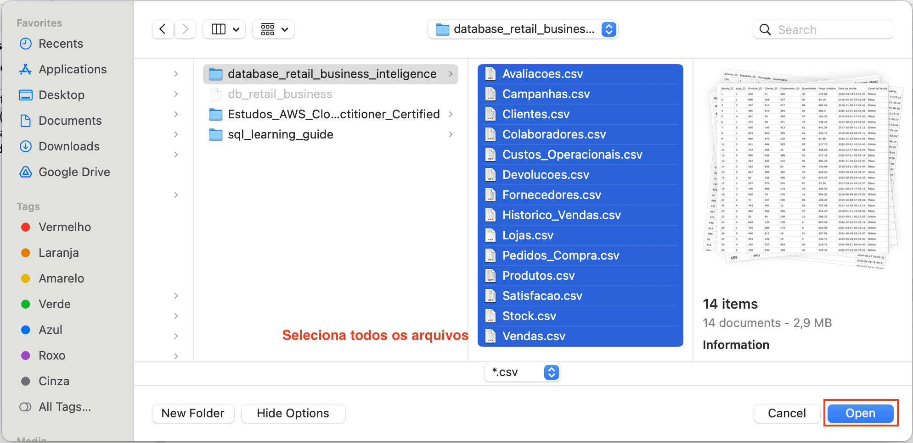

# Configurando o ambiente

# Índice
[wip]

# Instalar o DBeaver
Para começar, utilize o DBeaver (versão gratuita), um software de gerenciamento de banco de dados que facilita a manipulação e execução de SQL. Acesse o site oficial para baixar e instalar o DBeaver: [DBeaver](https://dbeaver.io/download/).

# Criar um banco de dados local com SQLite
Após a instalação do DBeaver, siga os passos abaixo para criar um banco de dados local utilizando o **SQLite**:

Abra o DBeaver e clique em "File > Novo"

.
.

Selecione SQLite como o tipo de banco de dados, conforme abaixo .

Selecione para procurar e forneça um nome e o local para o arquivo do banco de dados no diretório que você quiser, conforme abaixo.
.
.
.

Agora o banco de dados está criado, porém com nenhuma informação.
.

# Baixar o Banco de Dados do Kaggle
Acesse o [dataset de vendas no Kaggle](https://www.kaggle.com/datasets/guimacrlh/dataset-vendas?resource=download) e faça o download do arquivo zip. Este arquivo contém as tabelas em formato CSV, que serão usadas como fonte para a prática no tutorial.
.

# Importar as Tabelas CSV para o DBeaver
Com o arquivo zip baixado e extraído, você pode importar os arquivos CSV no DBeaver.

No DBeaver, clique com o botão direito no banco de dados recém-criado e selecione a opção para Importar Dados.
.

Siga as etapas para mapear corretamente as colunas e concluir a importação das tabelas, conforme abaixo.
.
.
.
.
.
.
.
.

Esses passos devem ajudar na configuração do ambiente para a prática do seu tutorial.

[ Home](../README.md)